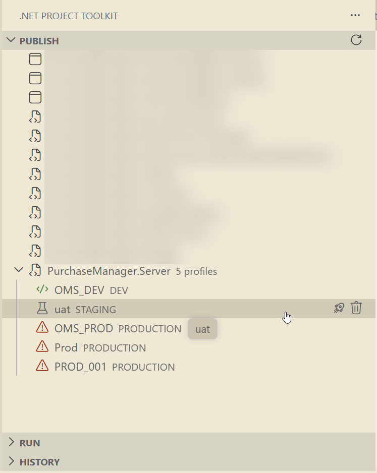
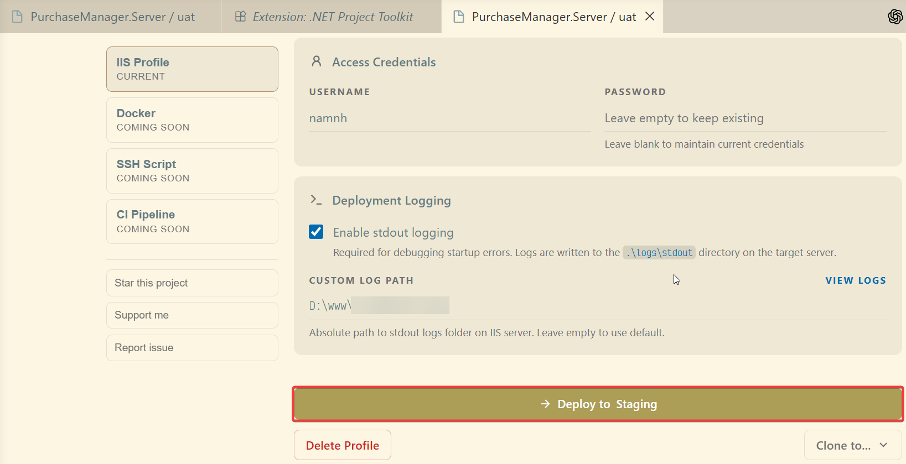
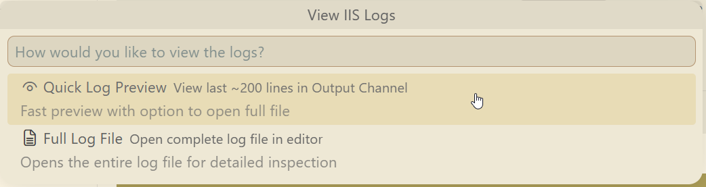
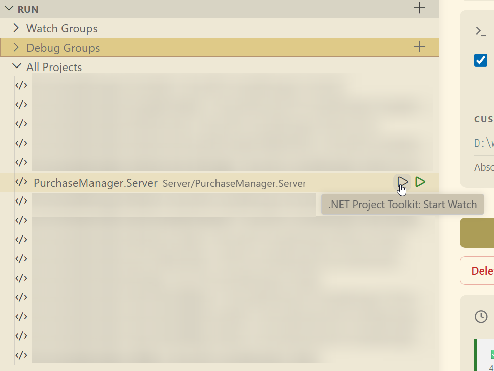
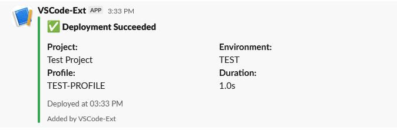

# .NET Project Toolkit

Deploy, watch, and debug .NET projects in one VS Code extension.

> Manage `.pubxml` profiles, deploy to IIS with MSDeploy, inspect IIS logs, and coordinate multi-project run/debug workflows without leaving VS Code.

[](https://github.com/alexnguyen03/dotnet-project-toolkit)
[](LICENSE)

<!-- Optional Marketplace badges (uncomment after publish)
[](https://marketplace.visualstudio.com/items?itemName=alexnguyen03.dotnet-project-toolkit)
[](https://marketplace.visualstudio.com/items?itemName=alexnguyen03.dotnet-project-toolkit)
[](https://marketplace.visualstudio.com/items?itemName=alexnguyen03.dotnet-project-toolkit)
-->

---

## Why This Extension

- Keep deployment + local run workflows in one place.
- Reduce manual profile editing and command copy/paste.
- Improve release confidence with history, health checks, and safer credential handling.

---

## Key Features

### Publish and Deployment

- Auto-detect `.csproj` projects and `.pubxml` publish profiles.
- One-click IIS deployment via MSDeploy.
- Create, edit, delete, import, and export publish profiles in VS Code.
- Optional post-deploy browser launch.
- Optional post-deploy health check with retry.
- Optional remote `web.config` stdout logging update.
- IIS log viewer:
    - Quick preview in output panel.
    - Open full log file in editor.
- Slack deployment notifications.

### Run, Watch, Debug

- Start/stop `dotnet watch` per project.
- Group projects and run/stop watch groups together.
- Start/stop debug per project or debug group.
- Unified run-state handling and quick reload/restart.

### Deployment History

- Track deployment status, timing, duration, and error details.
- Dedicated history view with refresh and cleanup actions.

---

## Demo

### 1) Publish View and Profile Management



### 2) One-Click Deploy + Health Check



### 3) IIS Log Viewer (Quick + Full)



### 4) Run/Watch/Debug Groups

## 

## Quick Start

1. Open a workspace that contains one or more .NET projects.
2. Open the **.NET Project Toolkit** activity bar view.
3. In **Publish**, create new profile, expand a project and click **Deploy** on a profile.
4. Open **Profile Info** to edit target URL, credentials, log path, and deployment options.

---

## Install from VSIX (No Marketplace Required)

### From CI Artifact (GitHub Actions)

1. Open the latest workflow run in **Actions** for `Build VSIX`.
2. Download artifact: `dotnet-project-toolkit-vsix`.
3. In VS Code, run: `Extensions: Install from VSIX...`
4. Select the downloaded `.vsix` file.

### Install via CLI

```bash
code --install-extension dotnet-project-toolkit-<version>.vsix
```

---

## Extension Views

- **Publish**: profile discovery, deploy, create/delete/import/export, profile details.
- **Run**: watch/debug project and group management.
- **History**: deployment history and cleanup actions.

---

## Commands (Public)

- `dotnet-project-toolkit.refreshHistory`
- `dotnet-project-toolkit.clearHistory`
- `dotnet-project-toolkit.clearHistoryEntry`
- `dotnet-project-toolkit.refreshProfiles`
- `dotnet-project-toolkit.createPublishProfile`
- `dotnet-project-toolkit.deletePublishProfile`
- `dotnet-project-toolkit.profileInfo`
- `dotnet-project-toolkit.exportPublishProfile`
- `dotnet-project-toolkit.importPublishProfile`
- `dotnet-project-toolkit.deployProfile`
- `dotnet-project-toolkit.watch.start`
- `dotnet-project-toolkit.watch.stop`
- `dotnet-project-toolkit.watch.stopAll`
- `dotnet-project-toolkit.watch.createGroup`
- `dotnet-project-toolkit.watch.deleteGroup`
- `dotnet-project-toolkit.watch.runGroup`
- `dotnet-project-toolkit.watch.stopGroup`
- `dotnet-project-toolkit.debug.start`
- `dotnet-project-toolkit.debug.stop`
- `dotnet-project-toolkit.debug.createGroup`
- `dotnet-project-toolkit.debug.runGroup`
- `dotnet-project-toolkit.debug.stopGroup`
- `dotnet-project-toolkit.debug.deleteGroup`
- `dotnet-project-toolkit.debug.stopAll`
- `dotnet-project-toolkit.run.reload`
- `dotnet-project-toolkit.testNotification`

---

## Configuration

Search `dotnet toolkit` in VS Code Settings.

| Setting                               | Default  | Description                                                                 |
| :------------------------------------ | :------- | :-------------------------------------------------------------------------- |
| `dotnetToolkit.passwordStorage`       | `secret` | `secret` (encrypted OS storage) or `envvar` (environment variable storage). |
| `dotnetToolkit.openBrowserOnDeploy`   | `true`   | Open browser after successful deployment.                                   |
| `dotnetToolkit.enableHealthCheck`     | `true`   | Run post-deploy health check.                                               |
| `dotnetToolkit.healthCheckTimeout`    | `10000`  | Health-check timeout (ms).                                                  |
| `dotnetToolkit.healthCheckRetryCount` | `3`      | Number of health-check retries.                                             |
| `dotnetToolkit.notificationPlatform`  | `none`   | Notification platform (`none` or `slack`).                                  |
| `dotnetToolkit.slackWebhookUrl`       | `""`     | Slack incoming webhook URL.                                                 |
| `dotnetWorkspace.dotnetPath`          | `dotnet` | Path to .NET CLI executable.                                                |

---

## Slack Demo Setup

Use this section when you want to quickly demo deployment notifications to Slack.

### 1) Create a Slack Incoming Webhook

1. Open [Slack API: Your Apps](https://api.slack.com/apps) and click **Create New App**.
2. Choose **From scratch**.
3. Enter app name (for example: `Dotnet Toolkit Notifier`) and select your workspace.
4. In app settings sidebar, open **Incoming Webhooks**.
5. Turn on **Activate Incoming Webhooks**.
6. Click **Add New Webhook to Workspace**.
7. Choose the Slack channel you want to receive deployment notifications.
8. Click **Allow** to authorize.
9. Copy the generated webhook URL (format: `https://hooks.slack.com/services/...`).

### 2) Configure VS Code settings

Add these settings (Workspace or User):

```json
{
	"dotnetToolkit.notificationPlatform": "slack",
	"dotnetToolkit.slackWebhookUrl": "https://hooks.slack.com/services/XXX/YYY/ZZZ"
}
```

### 3) Send a test message

Run command:

- `.NET Project Toolkit: Test Notification`

Expected result:

- VS Code shows success notification.
- A demo message appears in your configured Slack channel.



### 4) Demo flow suggestion

1. Trigger `.NET Project Toolkit: Test Notification`.
2. Show Slack channel receiving the test message.
3. Run a real deploy and show deployment notification in the same channel.

---

## Security Notes

- Credentials are stored in OS secure storage by default (`secret`).
- If you choose `envvar`, credentials are less secure and visible to local processes.
- Deployment/tooling commands use argument-based process spawning (no shell command concatenation) to reduce command-injection and quoting issues.
- Sensitive credential values are redacted from deployment logs.
- Production deployments require explicit confirmation.

---

## Troubleshooting

- **No projects/profiles found**: ensure `.csproj` and `.pubxml` files exist, then refresh views.
- **Deploy fails with credential errors**: verify profile username and stored password key.
- **Logs not found**: verify `LogPath` in profile and remote read permissions.
- **MSDeploy not found**: install Web Deploy and ensure `msdeploy.exe` is available.

---

## Community and Contributing

This project is community-driven. Contributions are very welcome.

### How to Contribute

- Report bugs with reproducible steps.
- Open feature requests with real deployment scenarios.
- Submit PRs for fixes, tests, UX improvements, and docs.

### Contributing Workflow

1. Fork the repository.
2. Create a feature branch.
3. Run:

```bash
npm run pretest
npm run test
```

4. Open a PR with clear description and screenshots/logs (if applicable).

Please read [CONTRIBUTING.md](CONTRIBUTING.md) before submitting.

---

## Build and CI/CD for VSIX

### Local VSIX build

```bash
npm run build:vsix
```

Output file will be created at repo root, for example:

```bash
dotnet-project-toolkit-0.1.0.vsix
```

### CI/CD workflow

- Workflow file: `.github/workflows/build-vsix.yml`
- Triggers:
    - `push` to `main` / `dev`
    - `pull_request` to `main` / `dev`
    - manual run (`workflow_dispatch`)
    - tag push `v*`
- Artifact name: `dotnet-project-toolkit-vsix`

### Update pipeline later (for maintainers)

Typical changes:

1. Update Node version in workflow (`actions/setup-node`).
2. Add extra quality gates before packaging (for example `npm test`).
3. Add release publishing step if you want tag builds to attach `.vsix` to GitHub Releases.

---

## Support

- [Ko-fi](https://ko-fi.com/alexnguyen03)
- [Paypal](https://paypal.me/alexnguyeen03)
